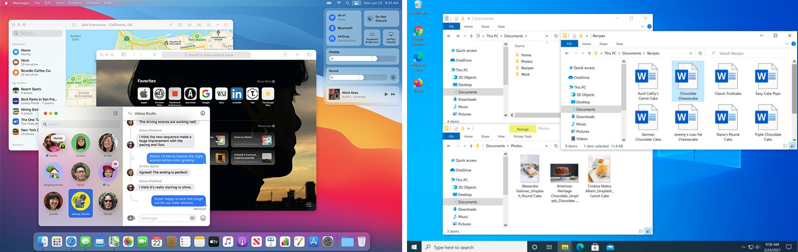
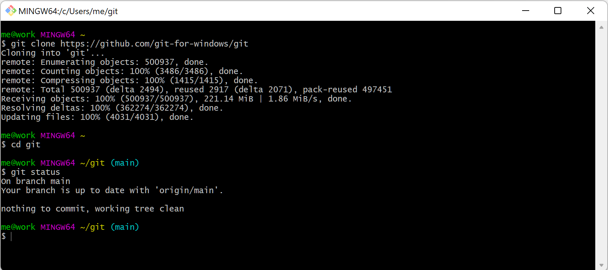

# Week 1: Introductions

***1/27/2022 Thursday***

**In class:** 

* Instructors and participants of the course will introduce themselves and their interests
* We will introduce the big lines and the syllabus for this course
* We will discuss two readings (see below) that touch upon major themes of this course
* Introduction to the command line interface (running programs by typing commands
with your keyboard rather than clicking icons with your mouse) and the file system of your computer

**Prepare for Class:**

* Read the following two articles: 
  - Andrew Piper, “There will be Numbers.” *Cultural Analytics* 1/1, 2016: 1-10. Available [online](https://culturalanalytics.org/article/11062-there-will-be-numbers) .
  - Savant, Sarah Bowen. “The History of Arabic books in the digital age.” *British Academy Review Summer* (2016): 42-45. Available [online](https://web.archive.org/web/20200926041246/https://www.thebritishacademy.ac.uk/documents/861/BAR28-11-Savant.pdf).

* Prepare for your first encounter with the command line interface: 
  - Windows users: install the software Git Bash (see [below](#install-git-bash)). Please do this before 25 January and contact the instructors if you encounter any problem installing this software, so we can help you out before class.
  - Mac users: you don't have to install a new program; we will use the built-in application Terminal.
    Follow the instructions [below](#activate-bash-mac) to prepare Terminal for class.
    
## Installing Git Bash on Windows {#install-git-bash}

NB: Mac and Linux users do not need to install Git Bash; they can use built-in software on their computers.

Most computer users today are used to interact with their computers by using their mouse
to click on objects on their screens: you open a program by clicking on its icon
on your desktop, click a link in a website, etc. A system that provides this kind 
of interaction is called a Graphical User Interface (GUI). 

The use of GUIs to run programs was an innovation of the 1980s and was very important
in popularizing the use of computers. Before that, users interacted with the 
computer using language, through a Command Line Interface (CLI): in a CLI, 
the user runs programs by typing commands with a keyboard. CLIs are still used 
to run many programs. 

There are multiple command line systems, each with their own grammar and lexicon;
these systems are often referred to as "shells". In order to limit the differences
between Windows, Mac and Linux users in this course, we are going to use one such shell
called bash. 

On Windows, we will use the Git Bash software rather than the standard 
command line interface in Windows, `cmd.exe`, which uses a slightly different 
grammar and lexicon. 

1. Download Git Bash together with Git for Windows here: https://gitforwindows.org/

2. Execute the downloaded file by double-clicking it. This will start an 
installation wizard that will guide you through the installation process. 
A few notes on the options you will be given during the installation process:

* In the page "Select Components" you can leave the options at their defaults.

* The Windows Explorer integration > Context menu entries option allows opening the Git command prompt (Git Bash) from any folder by clicking with the right mouse button on the folder and selecting Git Bash Here. The last option is also interesting in that it installs a better font for all console windows.

* On the next screen (Adjusting your path environment), choose the most conservative option: Use Git Bash only. This will make git commands available only in Git Bash and will not alter your PATH variable. Click Next.

* Another important setting: line endings. As you may know, Windows and Unix systems (Linux, Mac) have different formats of line breaks on text files. If you write a file with Windows line breaks, another person may have problems opening that file in Linux and vice versa. The line endings setting allows you to normalize this. Choosing the second option (Checkout as-is, commit Unix-style line endings), that won't change the line breaks when the file arrives but will convert them to Unix-style when you commit. That way, you don't risk committing Windows-style line breaks and everything is kept in Unix-style. Don't worry, even though you are in Windows, most of the text editors can read Unix line breaks just fine.

* After that one more Next, Finish, and Git and Git Bash are installed!

You can now open Git Bash by clicking the start menu icon in the bottom left corner
of your screen, typing "Git Bash", and then clicking the Git Bash icon.

## Activating bash in Terminal on Mac {#activate-bash-mac}

There are multiple command line systems, each with their own grammar and lexicon;
these systems are often referred to as "shells". We are going to use one such shell
called bash. 

On older Mac [operation systems](https://www.macworld.co.uk/feature/os-x-macos-versions-3662757/) 
(prior to MacOS Catalina (2019)), Terminal uses
bash by default; for more recent operation systems, we will have to make bash
the default. 

1. Open Terminal by opening Finder, and then clicking Applications > Utilities > Terminal
(alternatively, you can use Spotlight to find Terminal: press the
`command` and space keys on your keyboard and start typing Terminal; 
click `Terminal` in the search results to open the program).  
2. The Terminal program will open, containing two lines of text. 
The last character you see is called the "prompt": it prompts you to write commands.
If the prompt is the `$` character, you're all set: Terminal is already using bash. 
3. If the prompt is the `%` character, you'll have to type the following command after that `%`: 
`chsh -s /bin/bash`
and then press Enter to execute the command.
Terminal will ask you for your password; type it (you won't see it appear, 
for security reasons) and press Enter again.
4. Close and reopen Terminal; the prompt should now be a `$`

