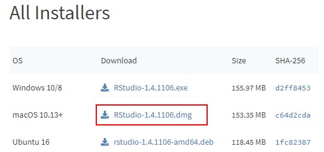
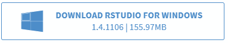
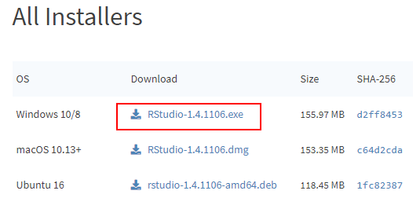
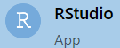
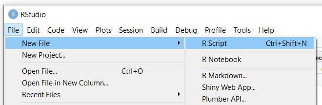
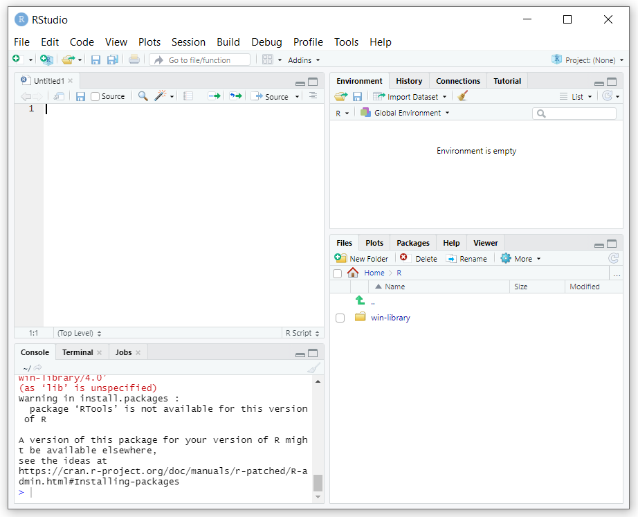

# Week 2: R Bootcamp: Metadata I

***2/3/2022 Thursday***

**Prepare for Class:**

* **Install** software (instructions below): 
  - [R](#installing-r)
  - [RStudio](#installing-rstudio)
* **Read**  introduction and part of the first chapter of Jeffery Pomerantz's book *Metada* (until p. 30)
* **Complete** the complete the CLI / File system exercise we started in class (see Moodle)

NB: please hand in a screenshot of the installed RStudio on your computer on Moodle, latest on Tuesday 1 February. If you have any trouble with the installation, ask us BEFORE Wednesday so we can solve any problem before the class starts.
  

## Installing R 

`R` is a programming language that is often used for data analysis.
It contains powerful and easy-to-use tools for statistical analysis and
creating graphs. 

The next weeks, we will provide an introduction to programming with `R`,
geared at absolute beginners, and provide multiple usage examples for 
digital humanists. 

Installing `R` is quite straightforward. We will install it from CRAN 
(The Comprehensive R Archive Network).

### On Mac
0. Before installing R, install XQuartz and [XCode](https://developer.apple.com/library/archive/technotes/tn2339/_index.html)
to avoid trouble down the line: 
* follow the instructions [here](https://www.verouden.net/post/2020/04/09/xquartz-installation-macos/#download) to download and install XQuartz
* Open Terminal, and run the following command: `xcode-select --install`
1. Download the latest R version: go to 
[cran.r-project.org/bin/macosx/](https://cran.r-project.org/bin/macosx/) 
and click on the `R-4.0.4.pkg` link to download `R` (the version number may be 
different; the website will always bring you to the link for the latest version)
2. click on the downloaded file to start the installation process. You can stick 
with the defaults, so click every `Next` button until you reach the end of the 
installation process. 

### On Windows
1. Go to [https://cran.r-project.org/](https://cran.r-project.org/), and click on "Download R for Windows"
2. Click "base"
3. Click "Download R 4.0.4 for Windows" (the version number may be different; the
website will always bring you to the link for the latest version)
4. Double-click the `R-4.0.4-win.exe` file (again, the version number may be different)
to start the installation process. You can stick with the defaults, so click
every `Next` button until you reach the end of the installation process. 

## Installing RStudio

RStudio is a working environment (IDE, *Integrated Development Environment*) 
for R that allows you to write R code and execute it. 

You can write `R` scripts in any text editor and execute them from any
command line program, but an IDE like RStudio makes writing and executing
`R` code much easier. 

**IMPORTANT: install RStudio only after you have installed R**

### On Mac
1. Go to [https://rstudio.com/products/rstudio/download/#download](https://rstudio.com/products/rstudio/download/#download)
2. Click the `DOWNLOAD RSTUDIO FOR MAC OS` button. If this button does not appear 
for some reason, click the download link for the macOS 10 version `.dmg file` 
in the table below: 

3. Click the downloaded `RStudio-1.4.1106.dmg` file (NB: the version number may 
be different; the website will always bring you to the link for the latest version)
to start the installation process. You can stick with the defaults, so click
every `Next` button until you reach the end of the installation process.

### On Windows

1. Go to [https://rstudio.com/products/rstudio/download/#download](https://rstudio.com/products/rstudio/download/#download)
2. Click the `DOWNLOAD RSTUDIO FOR WINDOWS` button: 

If this button does not appear for some reason, click the download link for the
Windows 10/8 version `.exe file` in the table below: 

3. Double-click the downloaded `RStudio-1.4.1106.exe` file (NB: the version number may be 
different; the website will always bring you to the link for the latest version)
to start the installation process. You can stick with the defaults, so click
every `Next` button until you reach the end of the installation process.

## The RStudio interface

1. Open RStudio
* in Windows: click the `Start` button at the bottom left of your screen, type
"RStudio" and click on the RStudio App button that appears: 
* on Mac: click RStudio in your `Applications` screen

2. The interface should look more or less like this: 

The interface contains three *panes*:

* On the left, you will find the **Console pane** , which allows you to write and
execute code interactively, just like in a command-line program. 
Note that the prompt in RStudio looks like `>`, not like `$`.
* On the top right, you will find the **Environment pane**, which will show you
the `R` objects in your current project, and a history of the most recent commands
you executed in the console pane. 
* On the bottom right, you will find the **Files pane**, where you can select 
files to open with RStudio. This pane also contains tabs for displaying graphs
you create in RStudio, Help information for using R and different packages 
(i.e., extensions of the `R` language), etc.

You can mimimize and maximize each pane using the `minimize` and `maximize` buttons
in each pane: 

The console pane allows you to write code interactively: after every line you 
write, `R` will execute (`run`) that line once you hit the `Enter` key. 

Sometimes it may be useful to write multiple commands and then execute these 
at once. Such a series of commands is called a **script** and is saved in a
text file with the extension `.r` (e.g., `hello_world.r`). One of the main advantages
of saving your commands in a script is that you can re-run the same series of 
commands whenever you wish. 

You can write a script in any text editor; but RStudio also contains a script 
editor that offers additional functionalities: an autocomplete function,
a button for executing your script, a debugger to help you find mistakes in
your scripts, etc. 

In order to start writing a script in RStudio, choose `File > New File > R Script` 
in the menu (or use the `Ctrl+Shift+N` shortcut):

This will open up a fourth pane in the RStudio window, called the **source pane**:

